# Hackintosh USB-Installer using Linux    

  ### Supported macOS versions
  - High Sierra 10.13.x
  - Mojave 10.14.x
  - Catalina 10.15.x
  

**For OpenCore EFI installers**   
  Use tribeam.sh script           
  ***https://github.com/Broly1/tribeam***
    
   **GibMacOS + finalflash.sh**   
   ***https://github.com/Broly1/finalflash***    
   ***https://github.com/corpnewt/gibMacOS***   
   Alternativelly if you prefere to use GibMacOS instead of ``tribeam.sh``   
   you may have to change the python path of ``gibMacOS.command``  
   from ``#!/usr/bin/env python`` to ``#!/usr/bin/env python3``  
   for it to work,  
   then run ``./gibMacOS.command`` press ``R`` to select recovery only     
   then Download the desired version of macOS, once done, Download ``finalflash.sh``  
   Extract it and paste it in the same directry as ``gibMacOS.command`` like in the picture bellow  
   and change its permissions   
   
   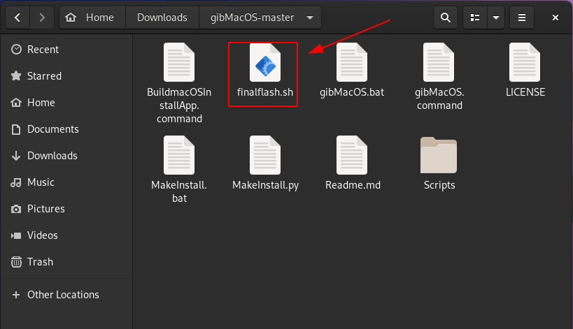  
   
   ``chmod +x finalflash.sh`` then run it as root ``sudo ./finalflash.sh`` it will show you a menu eg:    
``Please select the usb-drive!``  
``1) sda  223.6G``  
``2) sdb  465.8G``  
``3) sdc  931.5G``  
``4) sdd   14.9G``  
``#? ``  
In this example `4` is my usb drive so type `4` then it will install some necessary packages      
7zip wget and curl then it will prompt you to paste the path to the recovery file  
press enter and wait for it to create the installer with OpenCore, once done, the EFI partition         
will be mounted at the ``/mnt`` directory for you to edit it,  
To config the ``config.plist`` you can use ``ProperTree.command``   
https://github.com/corpnewt/ProperTree  
Just like ``gibMacOS.command`` you may have to change the python path of  
``ProperTree.command`` from ``#!/usr/bin/env python``  
 to ``#!/usr/bin/env python3`` and install ``python3-tk`` for it to work  
 eg for ubuntu ``sudo apt install python3-tk``  
 this should get you going good luck.    
    
  
    
        
### For manual instalation read this.
### Tools you'll need :
 GNOME Disks is a graphical front-end for udisks included in the "gnome-disk-utility" package.  
 GParted is a free partition editor for graphically managing your disk partitions.  
 DMG2IMG comand line tool that allows you to convert a (compressed) Apple Disk Images  
 gibMacOS - An awesome tool from CorpNewt ( https://github.com/corpnewt/gibMacOS )   
 A USB drive 8gb+  
 Some patience...
  

  ### Get macOS Installer with gibMacOS  
  Downloading the installer files fairly straight forward process but may take a while depending on your internet speeds.  
  To start extract gibMacOS and and open your terminal change directory to the gibmacos.command script.  
  Run it with `./gibMacOS.command `   
  ***This will allow you to choose the macOS version to download.*** 
  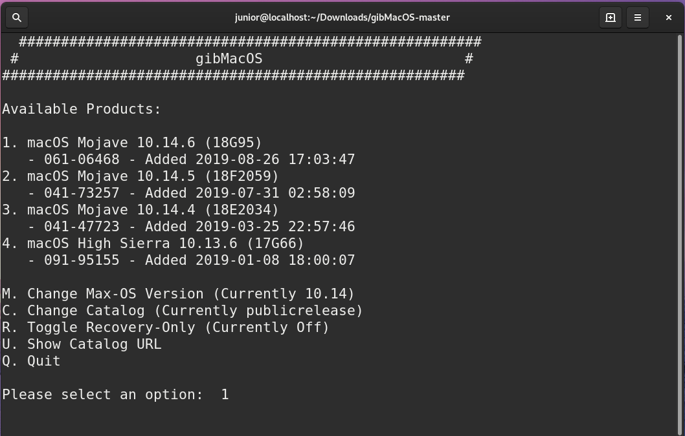  

  In my case I chose option 1. It will download the macOS installer files.  
  Make sure that BaseSystem.dmg is downloaded completely thats what we will use to create the installer  
  Once downloaded you can proceed to the next step.  
  ### Creating the macOS Install USB  
  Find BaseSystem.dmg inside `/gibMacOS-master/macOS\ Downloads/publicrelease/`  
  Drag it to your desktop or somewhere else if you prefer.  
  Open your terminal and change directory to where the BaseSystem.dmg file is in my case:  
  `cd Desktop`  
  Then run `dmg2img BaseSystem.dmg base.iso` it will convert the the `dmg` file to `iso` file named `base.iso`  
  Open `Disks` AKA "Gnome-Disk-Disk-Utility" and drag `base.iso` to it and hit start restoring.
  This will take a wile.  
  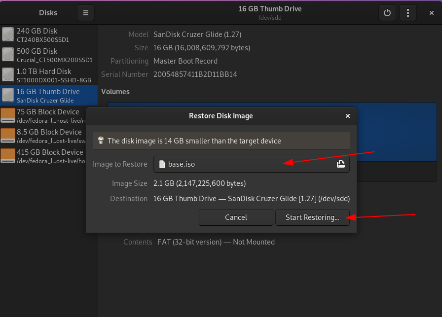  
 
  Once it is done restoring the iso open up `Gparted` and select your usb-drive.  
  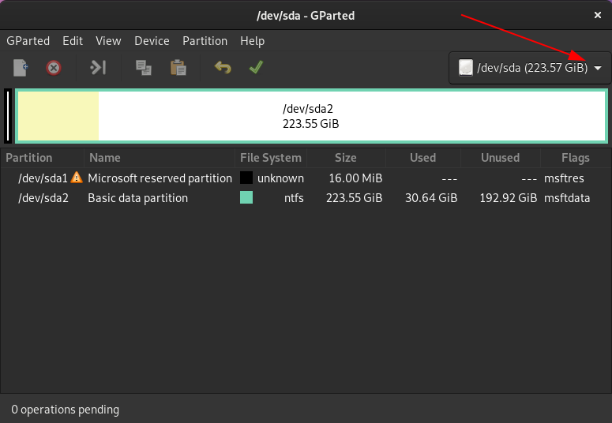  
  
 
  Rigth click in the unallocated space hit new      
  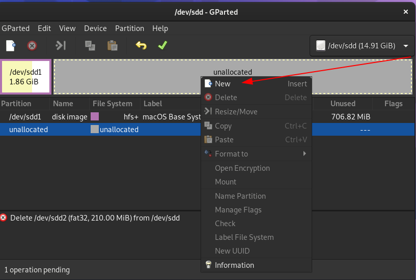   
  
  In File system select `fat32` and in lable type `EFI`  
   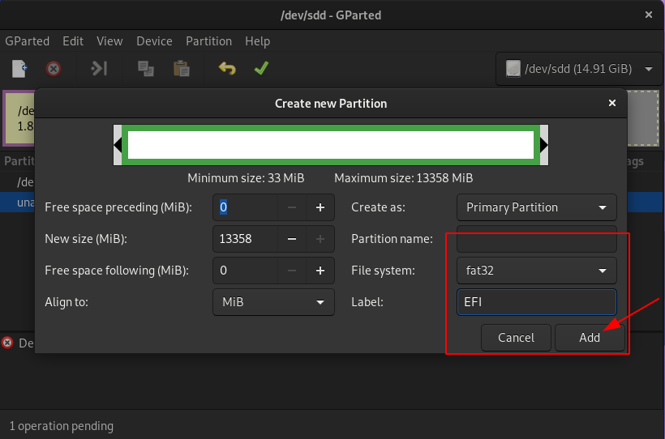  
   
   Hit apply     
   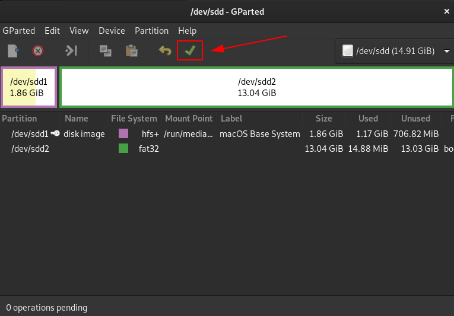  
     
   Once done applying changes righ click on your new EFI partition and hit `Manage Flags`  
   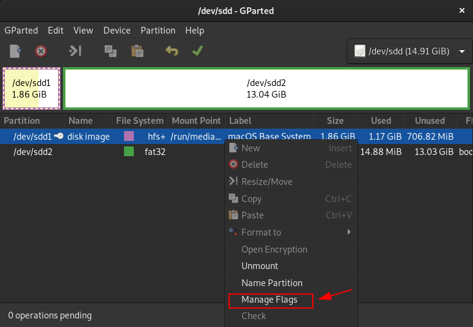   
     
   Select boot and esp  
   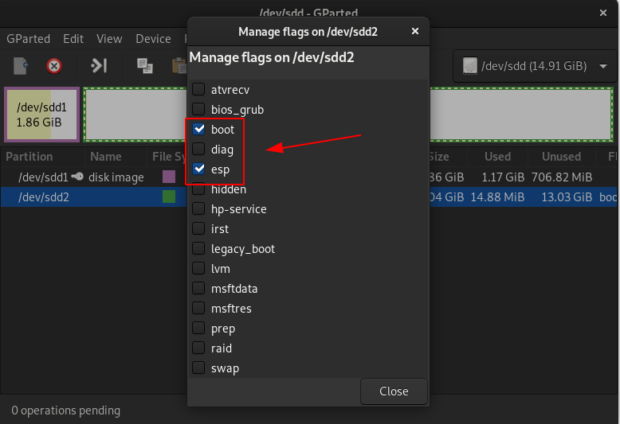      
      
   ***Now whe need to mount the EFI partition***  
   The easiest way is to open up `Disks` again and mount it that way     
   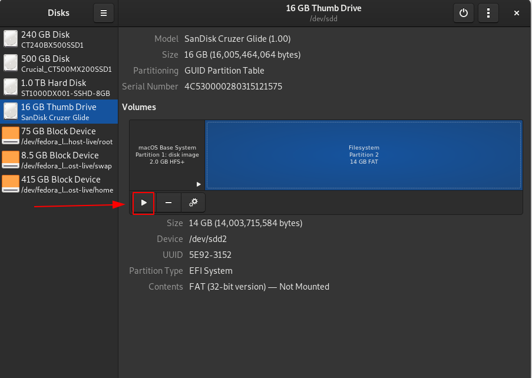    
      
   Now you should see an empty EFI partition in your file system  
       
   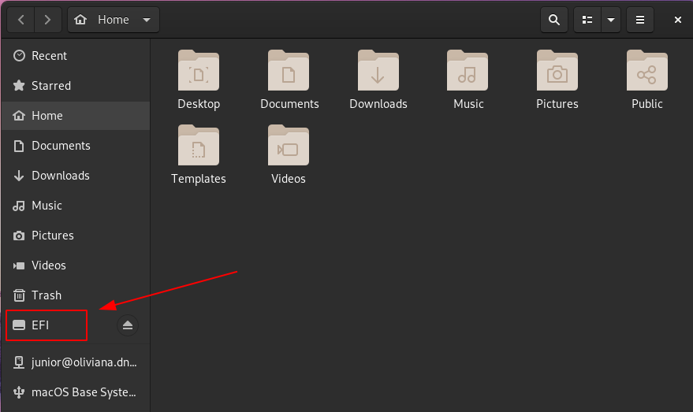  
   
   ### For OpenCore  
   
   ***Download OpenCore-x.x.x-RELEASE.zip***      
   https://github.com/acidanthera/OpenCorePkg/releases  
   Extract it and drop OpenCore EFI folder in the EFI partition we just created  
   and fallow the OpenCore Vanilla Guide.      
   https://dortania.github.io/OpenCore-Desktop-Guide/     
   
   ### For Clover       
   ***Download CloverISO-xx.tar.lzma***      
      https://github.com/CloverHackyColor/CloverBootloader/releases  
   Extract it then extract the iso as well and copy the EFI folder to the empty EFI partition    
   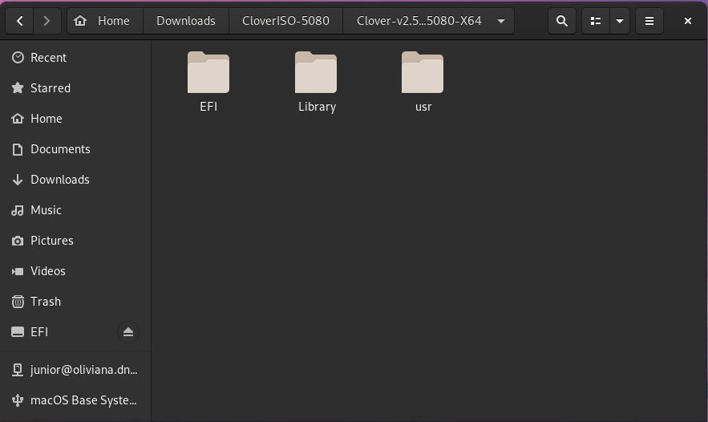  
        
   ### Drivers  
   Now open EFI/CLOVER/drivers/UEFI and all we need there are:    
   ApfsDriverLoader.efi AptioMemoryFix.efi HFSPlus.efi    
   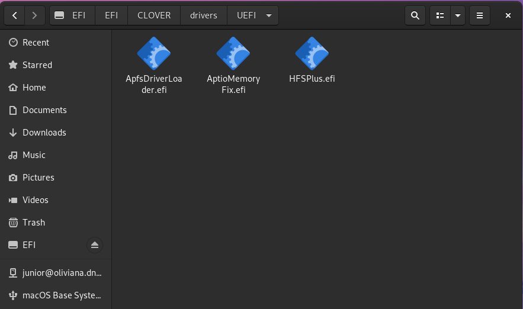
        
        
   ### Kexts  
        
   Now download your kexts here:    
   https://onedrive.live.com/?authkey=%21APjCyRpzoAKp4xs&id=FE4038DA929BFB23%21455036&cid=FE4038DA929BFB23    
   Place your kexts in /EFI/CLOVER/kexts/other   
   To know what kexts you need check this link:    
        https://hackintosh.gitbook.io/-r-hackintosh-vanilla-desktop-guide/gathering-kexts  
        
   ***This is how my kexts folder looks like***    
   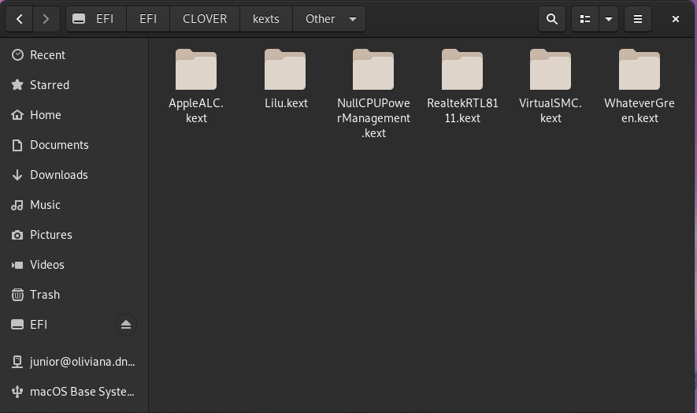     
        
   You should have a sample `config.plist` inside /EFI/CLOVER remove it.  
    If on amd cpu get your sample config.plist here:  
        https://github.com/AMD-OSX/AMD_Vanilla  
        
   If on Intel cpu you can get a sample here:  
   https://github.com/corpnewt/Hackintosh-Guide   
        
   ***Make sure to learn the basics of config.plist***  
   https://github.com/corpnewt/Hackintosh-Guide/blob/master/config.plist-basics.md  

  This shoud be enough to boot into the installer GOOD Luck!!  

        
   ## Credits to:
   **Scooby-Chan CorpNewt algrey Hackintosh Slav and many others**        
