# Welcome to AMD OS X Vanilla Made On Linux

## Tools you'll need :
 GNOME Disks is a graphical front-end for udisks included in the "gnome-disk-utility" package.  
 GParted is a free partition editor for graphically managing your disk partitions.  
 DMG2IMG comand line tool that allows you to convert a (compressed) Apple Disk Images  
 gibMacOS - An awesome tool from CorpNewt ( https://github.com/corpnewt/gibMacOS )  
 The Vanilla AMD config courtesy of AlGrey ( https://github.com/AMD-OSX/AMD_Vanilla )  
 A USB drive 8gb+  
 Some patience...
## This guide will support the following versions of macOS on Zen and 15H/16H AMD:  

### High Sierra 10.13.6 (17G65, 17G66, 17G8030)  
### Mojave 10.14.6 (18G84, 18G87, 18G95)  
### Catalina 10.15 (19A583)
  
  ## Get macOS Installer with gibMacOS  
  Downloading the installer files fairly straight forward process but may take a while depending on your internet speeds.  
  To start extract gibMacOS and and open your terminal change directory to the gibmacos.command script.  
  Run it with `./gibMacOS.command `   
  ***This will allow you to choose the macOS version to download.*** 
  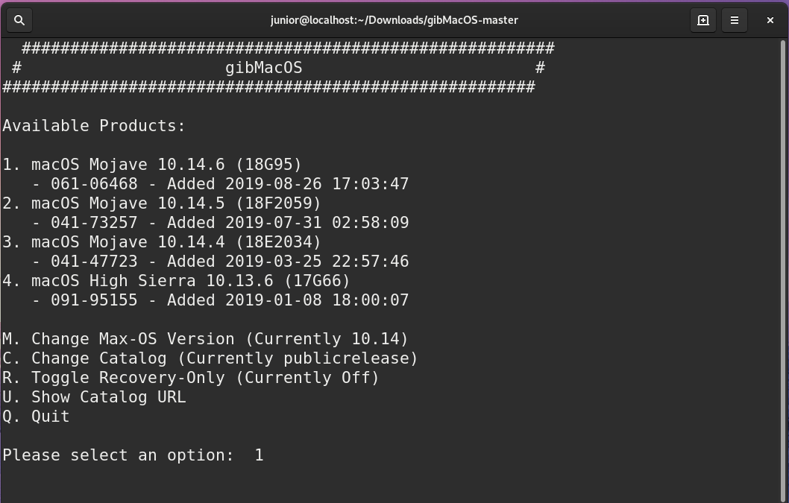  

  In my case I chose option 1. It will download the macOS installer files.  
  Make sure that BaseSystem.dmg is downloaded completely thats what we will use to create the installer  
  Once downloaded you can proceed to the next step.  
  ## Creating the macOS Install USB  
  Find BaseSystem.dmg inside `/gibMacOS-master/macOS\ Downloads/publicrelease/`  
  Drag it to your desktop or somewhere else if you prefer.  
  Open your terminal and change directory to where the BaseSystem.dmg file is in my case:  
  `cd Desktop`  
  Then run `dmg2img BaseSystem.dmg base.iso` it will convert the the `dmg` file to `iso` file named `base.iso`  
  Open `Disks` AKA "Gnome-Disk-Disk-Utility" and drag `base.iso` to it and hit start restoring.
  This will take a wile.  
  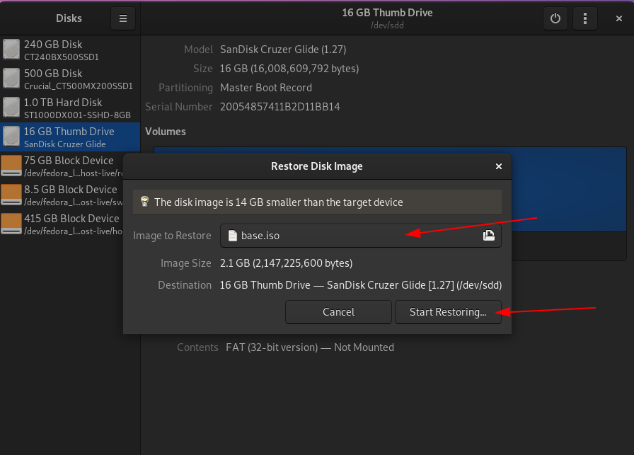  
 
  Once it is done restoring the iso open up `Gparted` and select your usb-drive.  
  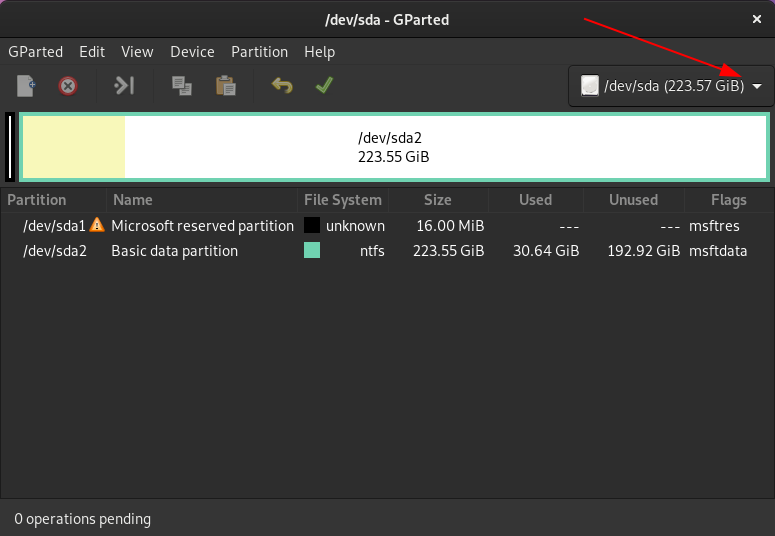   
 
  Rigth click on the macOS partition and hit resize/move  
  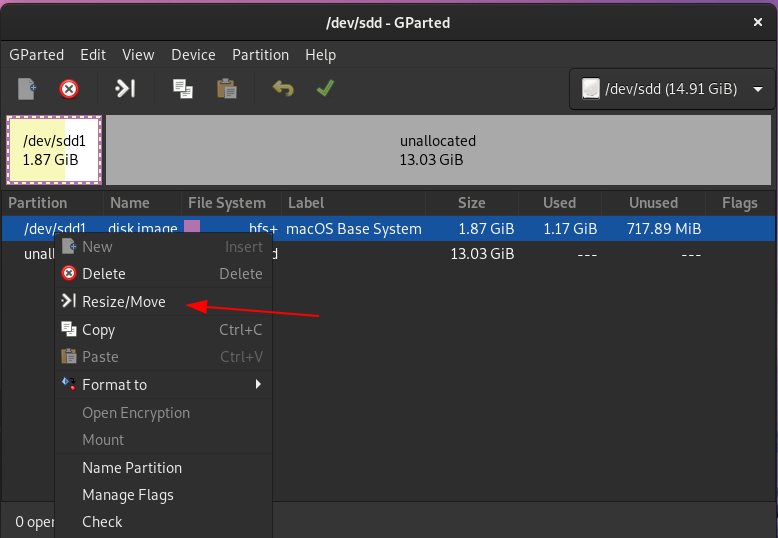   
  
   Give it `200MB` of space make sure you hit the `+` for it to work :) and hit Resise/Move  
   It will move the whole hfs+ partition to the right and give us 200MB free space for our EFI partition.     
     
   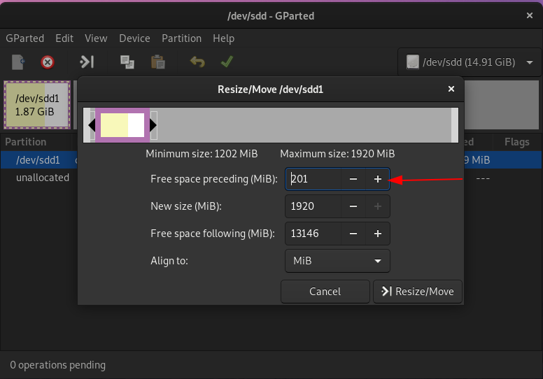   
  
   Do not forget to hit apply, This will take a long time sit tight.     
   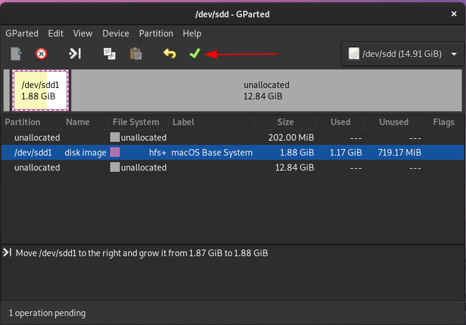   
   
   Right click on your new 200MB unallocated space.   
   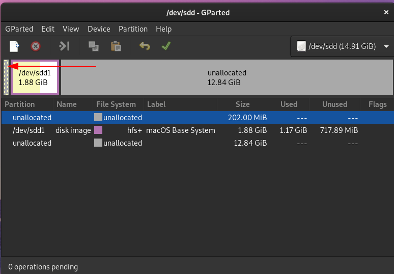  
     
   Hit New  
   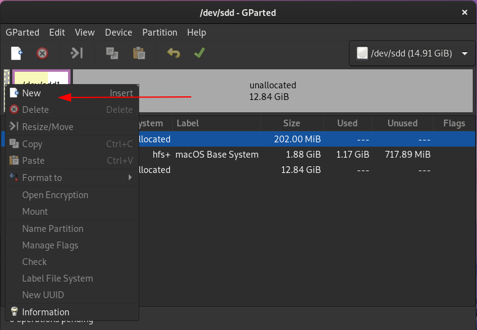  
     
   In File System set it to `fat32` and in Label `EFI`         
   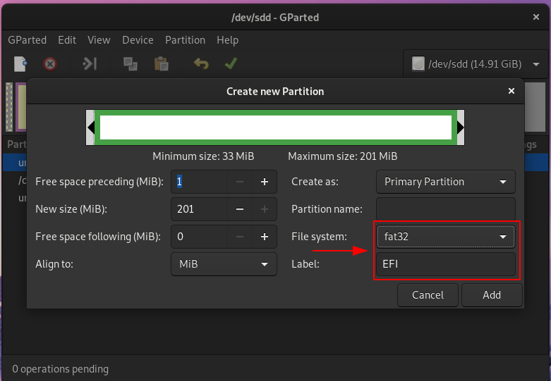  
     
   Hit apply again   
   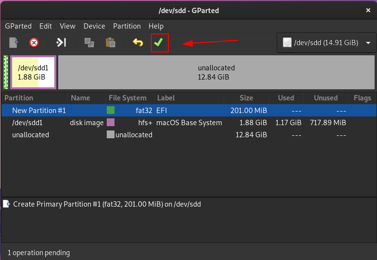  
     
   Once done applying changes righ click on your new EFI partition and hit `Manage Flags`  
   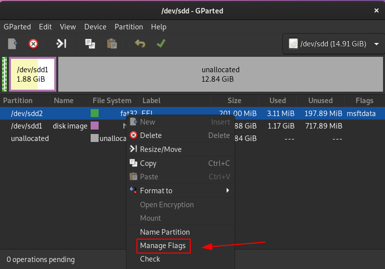   
     
   Select boot and esp  
   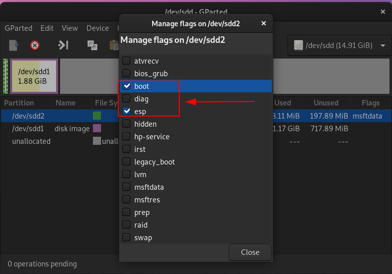    
      
   ***Now whe need to mount the EFI partition***  
   The easiet way is to open up `Disks` again and mount it that way     
   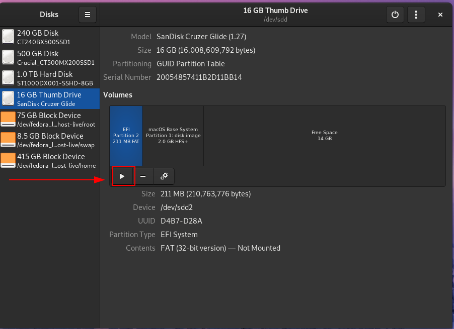   
      
   Now you should see an empty EFI partition in your file system  
       
   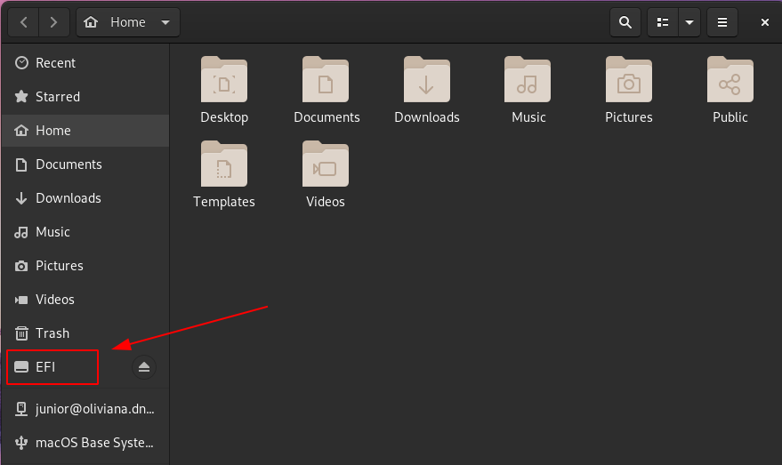  
        
   ## Installing Clover  
       
   ***Download CloverISO-xx.tar.lzma***      
   https://github.com/Dids/clover-builder/releases            
   Extract it then extract the iso as well and copy the EFI folder to the empty EFI partition    
   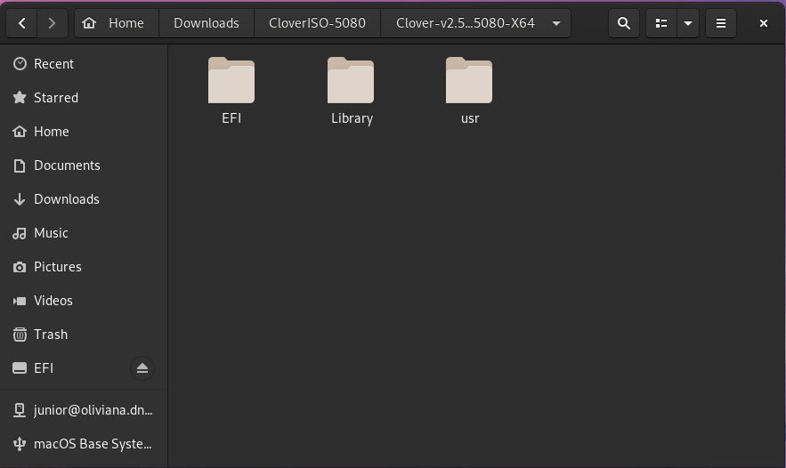  
        
   ## Drivers  
   Now open EFI/CLOVER/drivers/UEFI and all we need there are:    
   ApfsDriverLoader.efi AptioMemoryFix.efi HFSPlus.efi    
   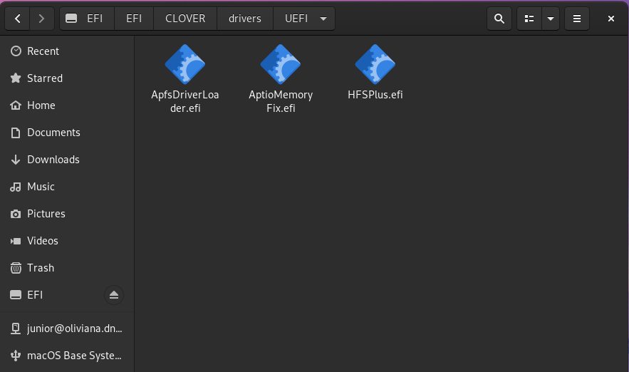
        
        
   ## Kexts  
        
   Now download your kexts here:    
   https://onedrive.live.com/?authkey=%21APjCyRpzoAKp4xs&id=FE4038DA929BFB23%21455036&cid=FE4038DA929BFB23    
   Place your kexts in /EFI/CLOVER/kexts/other   
   To know what kexts you need check this link:  
        https://vanilla.amd-osx.com/setting-up-clover-for-amd-vanilla/kexts.html

   You will also need [AppleMCEReporterDisabler.kext](https://github.com/AMD-OSX/AMD_Vanilla/raw/master/Extra/AppleMCEReporterDisabler.kext.zip) on Catalina too.
        
   ***This is how my kexts folder looks like***    
   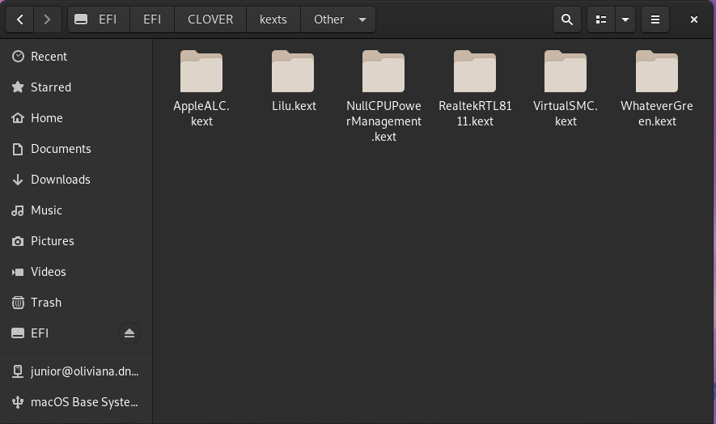   
        
   You should have a sample `config.plist` inside /EFI/CLOVER remove it.  
    If on amd cpu get your sample config.plist here:  
        https://github.com/AMD-OSX/AMD_Vanilla  
        
   If on Intel cpu you can get a sample here:  
   https://github.com/corpnewt/Hackintosh-Guide   
        
   ***Make sure to learn the basics of config.plist***  
   https://github.com/corpnewt/Hackintosh-Guide/blob/master/config.plist-basics.md   
        
  This shoud be enough to boot into the installer GOOD Luck!!  
        
  

        
        
   ## All Credits to:
   **CorpNewt algrey Shannee XLNC.**        
